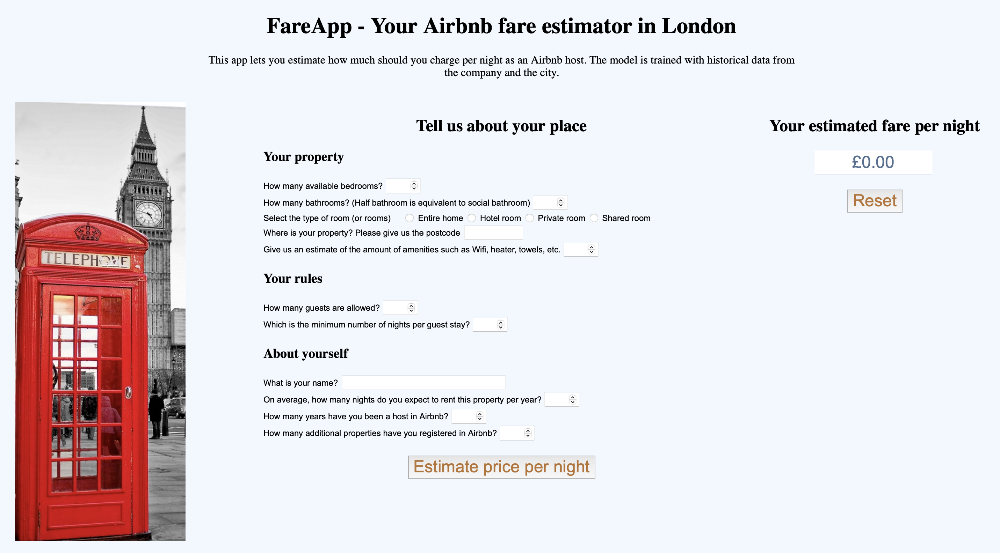

[![LinkedIn][linkedin-shield]][www.linkedin.com/in/rafael-machado-molina]

# fareApp - your Airbnb pricing calculator for London

## About the project

fareApp was created from a data engineering project and the idea to help future hosts estimate a rental price according to their characteristics. fareApp is an easy-to-use web application, only available in London (for now). Please give it a try [here!](https://prod.d3vut9tvhicpld.amplifyapp.com) 

(<a href="#top">back to top</a>)

### Built With

* [PySpark](https://spark.apache.org/docs/latest/api/python/)
* [Python](https://www.python.org)
* [Jupyter](https://jupyter.org)
* [AWS](https://aws.amazon.com)
* [PostgreSql](https://www.postgresql.org)
* [Javascript](https://www.javascript.com)
* [Docker](https://www.docker.com)

(<a href="#top">back to top</a>)

## Usage

All elements of the applications are stored in this repo. Please feel free to explore the notebooks and scripts.

(<a href="#top">back to top</a>)

## Contact

Rafael Machado Molina - [@rafaelmachadom](https://twitter.com/rafaelmachadom) - r.machado.molina@gmail.com

Project Link: [https://github.com/rafaelmachadomolina/fareApp](https://github.com/rafaelmachadomolina/fareApp)

(<a href="#top">back to top</a>)
